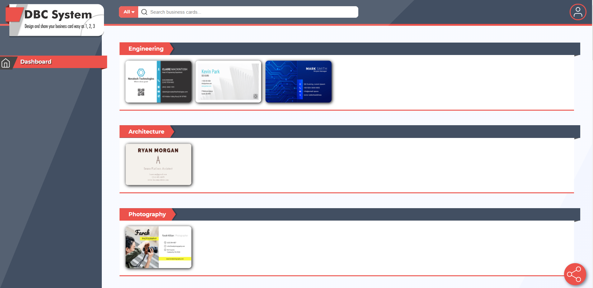
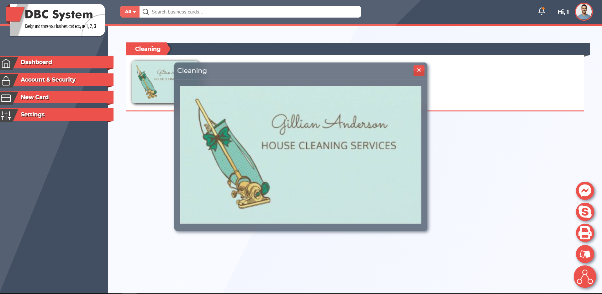
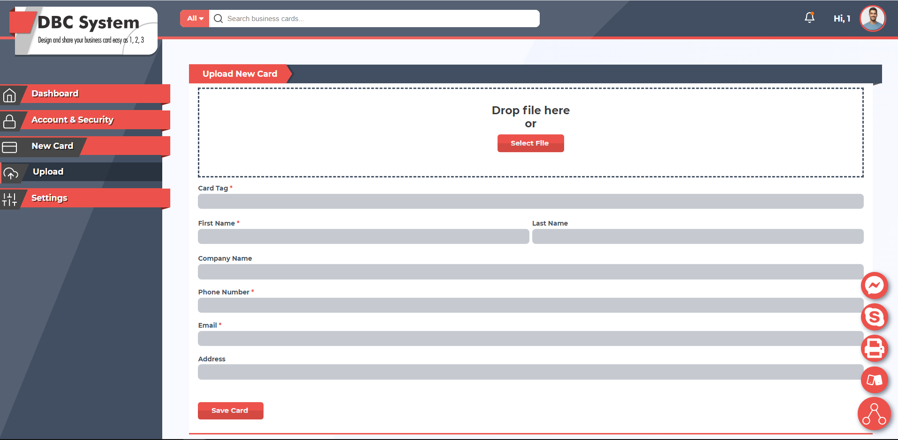

# React DBC System

## Introduction

Never buy new business cards again, always up-to-date with your latest information. Share your contact details digitally and stop wasting paper and money.

## Available Scripts

In the folder server, you can run:

### `npm start`

Runs the app in the development mode. 
Open [http://localhost:3000](http://localhost:3000) to view it in the browser.

The page will reload if you make edits. 
You will also see any lint errors in the console.

### `npm test`

Launches the test runner in the interactive watch mode. 
See the section about [running tests](https://facebook.github.io/create-react-app/docs/running-tests) for more information.

### `npm run build`

Builds the app for production to the `build` folder. 
It correctly bundles React in production mode and optimizes the build for the best performance.

The build is minified and the filenames include the hashes. 
Your app is ready to be deployed!

See the section about [deployment](https://facebook.github.io/create-react-app/docs/deployment) for more information.

## Technologies used

-   Styling: HTML5 / SCSS
-   Front-end: React.js / Webpack / Mapbox-GL
    Axios / Promise / FileStack React
-   Server: Node.js / Express / JWT / Request-Promise
-   Database: MongoDB / Mongoose / Models with Reference and Embedded
-   DevOps: Git / GitHub / Heroku

## Web Site Link

https://project3-bcs.herokuapp.com/
